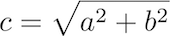

Getting started
===============

Refer to [Lab 1](lab01.html) if you need a reminder about how to start **Cygwin Terminal** or **Notepad++**.

Start by downloading [CS101\_Lab03.zip](CS101_Lab03.zip), saving it in the directory **H:\\CS101**. Using Windows File Explorer, navigate to your **CS101** directory on your **H:** drive and right click on the **CS101\_Lab03.zip** file and select **Extract All**. This should create a subdirectory named **CS101\_Lab03** that contains the lab files. 

**NOTE:** If there is another **CS101\_Lab03** subdirectory inside the **CS101\_Lab03** subdirectory, move the files to the outer **CS101\_Lab03** subdirectory and delete the inner one.

Start a **Cygwin Terminal** and run the following commands:

    cd h:
    cd CS101
    cd CS101_Lab03

Using **Notepad++**, open the file

> **H:\\CS101\\CS101\_Lab03\\RightTriangle.cpp**

Right Triangle
==============

Your task in this lab is to read two **double** values from the user which will represent the lengths of two sides of a right triangle. You will then use these values to compute the length of the hypotenuse for the right triangle.

Here is an example run of the program (user input in **bold**):

<pre>
Enter the length of side 1: <b>8.5</b>
Enter the length of side 2: <b>4.3</b>

The right triangle will have sides with lengths:
Side 1: 8.5
Side 2: 4.3
Hypotenuse: 9.5

</pre>

Each double quantity should be printed with one digit of precision after the decimal point.

When you are ready to compile the program, in the Cygwin window type the command

    make

when you are ready to compile the program. To run the program, run the command

    ./RightTriangle.exe

**IF** you get an error message that the file is not found, ensure that you are in the correct directory and that there are no syntax errors in your source code.

Hints
=====

Store the input values in variables of type **double**.

Use the **scanf** function to read values typed by the user into your **double** variables. Use the **%lf** conversion specifier (that's "percent", "lower-case L","lower-case F") for the **double** values. Note: Do not forget the **&** before the variable in the **scanf** statements.

Create a variable for the hypotenuse of type **double**.

The formula for the length of the hypotenuse of a right triangle with sides of lenghts *a* and *b* is given by

> 

Consider how to compute **x**2 as C does not have an exponentiation operator.

The square root function in C (in **math.h**) is **sqrt()**.

Use the **printf** function to print the output using the **%.\#lf** placeholder where **\#** is the number of desired decimal places.

Submit
======

To submit your work, type the command

    make submit

Enter your Marmoset username and password (which you should have received by email.) Note that your password will not be echoed to the screen.
