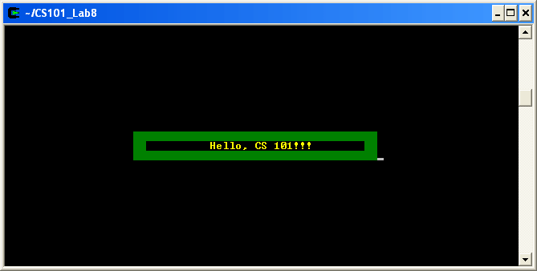

Getting Started
===============

Start by downloading [CS101\_Lab13.zip](CS101_Lab13.zip), saving it in the directory **H:\\CS101**. Using Windows File Explorer, navigate to your **CS101** directory on your **H:** drive and right click on the **CS101\_Lab13.zip** file and select **Extract All**. This should create a subdirectory named **CS101\_Lab13** that contains the lab files. 

**NOTE:** If there is another **CS101\_Lab13** subdirectory inside the **CS101\_Lab13** subdirectory, move the files to the outer **CS101\_Lab13** subdirectory and delete the inner one.

Start a **Cygwin Terminal** and run the following commands:

    cd h:
    cd CS101
    cd CS101_Lab13

Using **Notepad++**, open the file

> **H:\\CS101\\CS101\_Lab13\\FancyOutput.cpp**

Your Task
=========

Your task is to modify the **main** function in **FancyOutput.cpp** so that it displays the following output:

> 

Your program's output doesn't have to match this screenshot exactly, but it should be similar.

Instead of using the **printf** function to print output to the screen, use the following functions:

**cons\_move\_cursor(** *row*, *col* **)**

Move the cursor to a specified row and column of the screen. Row and column values start at 0. The default size of the output window is 80 columns by 25 rows.

**cons\_change\_color(** *foreground*, *background* **)**

Change the displayed text color to the given foreground and background colors. Possible colors are **BLACK**, **RED**, **GREEN**, **YELLOW**, **BLUE**, **MAGENTA**, **CYAN**, and **GRAY**. You can add the special value **INTENSE** to a color to create a brighter color.

**cons\_printw(** *format* [, *values* ] **)**

This function works just like **printf**, except that it works with the previous functions to allow arbitrary placement and coloring of printed text.

For example:

    cons_change_color(YELLOW+INTENSE, BLACK);
    cons_move_cursor(12, 32);
    cons_printw("Hello, CS 101!!!");

This code prints **Hello, CS 101!!!** in bright yellow text on a black background near the middle of the output window.

When you are ready to compile the program, in the Cygwin window type the command:

    make

To run the program, in the Cygwin window type the command

    ./FancyOutput.exe

**IF** you get an error message that the file is not found, ensure that you are in the correct directory and that there are no syntax errors in your source code.

Hints
=====

You can draw solid blocks of color by using **cons\_change\_color** to set the background to the color you want to draw, and then using **cons\_printw** to print space characters.

Submit
======

When you are done, run the following command from the Cygwin bash shell:

    make submit

You will be prompted for your Marmoset username and password, which you should have received by email. Note that your password will not appear on the screen.
