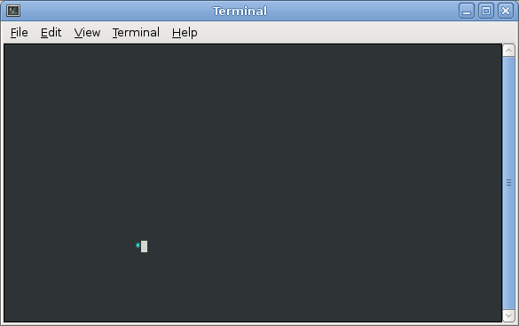

In this lab, you will implement an animation of a bouncing character using the console graphics functions, using a struct type to represent the current state of the animation and using *accessor functions* to perform operations.

Getting Started
===============

Refer to [Lab 1](lab1.html) if you need a reminder about how to start **Cygwin Terminal** or **Notepad++**.

Start by downloading [CS101\_Lab14.zip](CS101_Lab14.zip), saving it in the directory **H:\\CS101**. Using Windows File Explorer, navigate to your **CS101** directory on your **H:** drive and right click on the **CS101\_Lab14.zip** file and select **Extract All**. This should create a subdirectory named **CS101\_Lab14** that contains the lab files. 

**NOTE:** If there is another **CS101\_Lab14** subdirectory inside the **CS101\_Lab14** subdirectory, move the files to the outer **CS101\_Lab14** subdirectory and delete the inner one.

Start a **Cygwin Terminal** and run the following commands:

    cd h:
    cd CS101
    cd CS101_Lab14

Using **Notepad++**, open the file

> **H:\\CS101\\CS101\_Lab14\\Boing.cpp**

Your Task
=========

In this lab, you will implement a simple bouncing ball animation using the console window.

Here is the main function of the program in **Boing.cpp**, which you will not need to change:


int main(void) {
    // NOTE: you don't need to change anything in the main() function

    struct Scene myScene;

    myScene = scene_init();

    int keep_going = 1;
    while (keep_going == 1) {
        // clear the off-screen display buffer
        cons_clear_screen();

        // render the scene into the display buffer
        scene_render(myScene);

        // copy the display buffer to the display
        cons_update();

        // pause
        cons_sleep_ms(ANIMATION_DELAY);

        // update the scene
        myScene = scene_update(myScene);

        // see if the user has pressed a key
        int key = cons_get_keypress();
        if (key != -1) {
            keep_going = 0;
        }
    }

    return 0;
}


The idea is simple:

-   the **myScene** variable represents the scene to be displayed (the location and current direction of the animated character)
-   the **scene\_init()** function returns a **Scene** with its fields initialized to default initial values
-   the **scene\_render()** function takes the current scene as a parameter (by value) and, using the **cons\_move\_cursor()**, **cons\_change\_color()**, and **cons\_printw()** functions, renders the current scene into an off-screen display buffer. (Note: **cons\_printw()** works just like **printf()**, except that it prints text into an off-screen display buffer, rather than printing directly into the window. This eliminates display flickering.)
-   the **scene\_update()** function takes the current **Scene** as a parameter and returns an updated **Scene** representing the next frame of animation (so that the position of the character changes, and if the character has bounced, then its direction should change as well)

Your task is to add fields to the **Scene** struct type to keep track of the state of the animation, and to implement the functions **scene\_init()**, **scene\_render()**, and **scene\_update()**. You must implement these functions such that the program will display a "bouncing character" animation.

> 

The general idea is that the **struct Scene** type should contain fields that maintain the position and direction of the animated character. For example, in my bouncing ball implementation, my **struct Scene** type is defined this way:


struct Scene {
    int x, y;
    int dx, dy;
};


The **x** and **y** fields maintain the current column and row of the ball, and the **dx** and **dy** fields maintain the current direction (1 for forward, -1 for backward) for the **x** and **y** directions.

When you are ready to compile the program, in the Cygwin window type the command

    make

To run the program, in the Cygwin window type the command

    ./Boing.exe

**IF** you get an error message that the file is not found, ensure that you are in the correct directory and that there are no syntax errors in your source code.

Submit
======

When you are done, run the following command from the Cygwin bash shell:

    make submit

You will be prompted for your Marmoset username and password, which you should have received by email. Note that your password will not appear on the screen.
